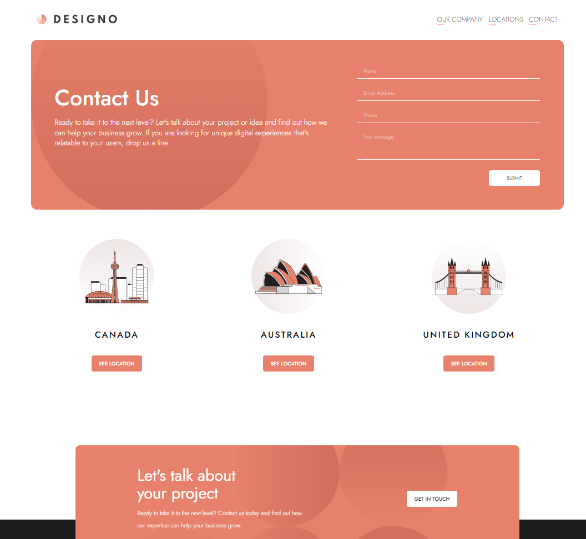
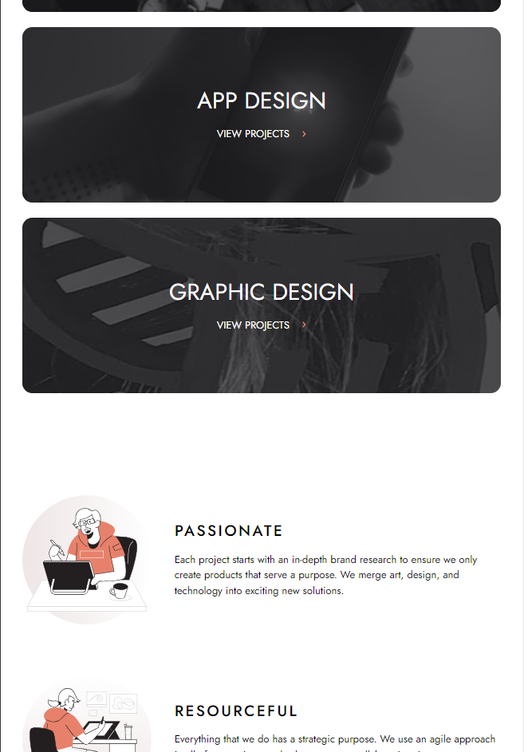
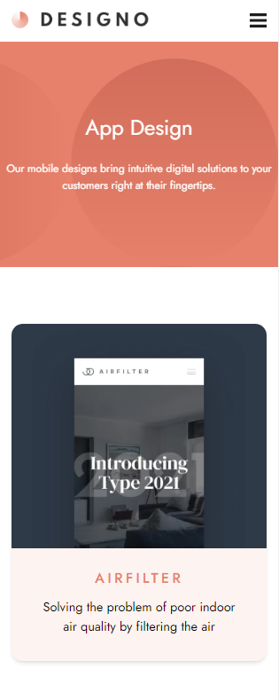

# Welcome! 👋


- This project includes a 7-page site. 
  - That allowed me train my organize skills, folder structure and so on...
  - Now I know that keeping section features in one place is better option than structure which I applied in my project


## Your users should be able to:
- View the optimal layout for each page depending on their device's screen size
- See hover states for all interactive elements throughout the site
- Receive an error message when the contact form is submitted if:
  - The `Name`, `Email Address` or `Your Message` fields are empty should show "Can't be empty"
- View actual locations on the locations page maps 


## Tech Stack:


- Semantic HTML5 markup
- Mobile-first workflow
- [React](https://reactjs.org/) - JS library
- [Next.js](https://nextjs.org/) - React framework
- [Tailwind](https://tailwindcss.com/) - Library For styles

### Desktop Preview

### Desktop Contact page

### Tablet Home page

### Mobile App-design page



## Getting Started

This is a [Next.js](https://nextjs.org/) project bootstrapped with [`create-next-app`](https://github.com/vercel/next.js/tree/canary/packages/create-next-app).

```bash
npm install
# or
yarn install
```

First, run the development server:

```bash
npm run dev
# or
yarn dev
```

Open [http://localhost:3000](http://localhost:3000) with your browser to see the result.

